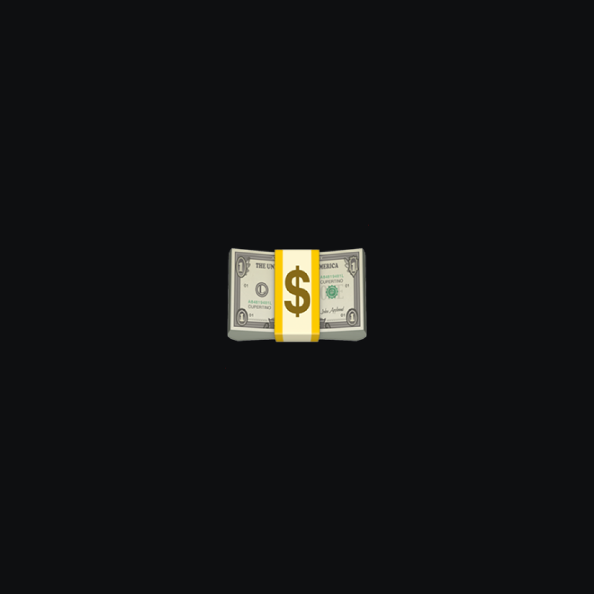
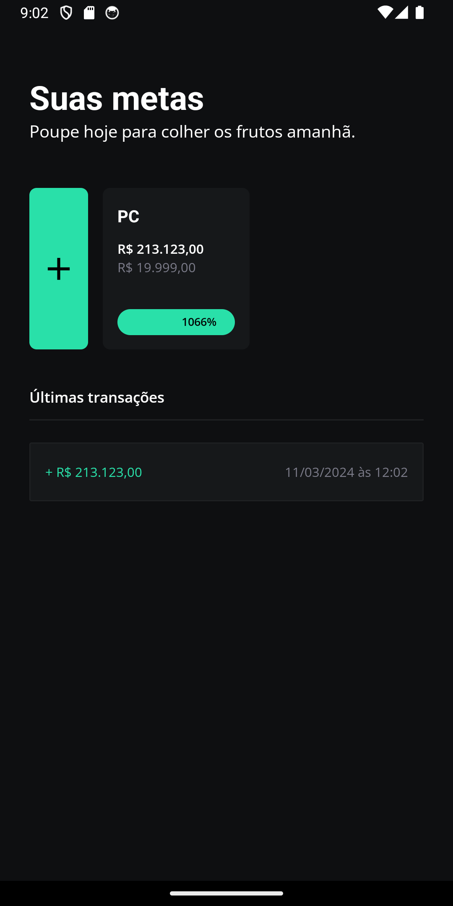
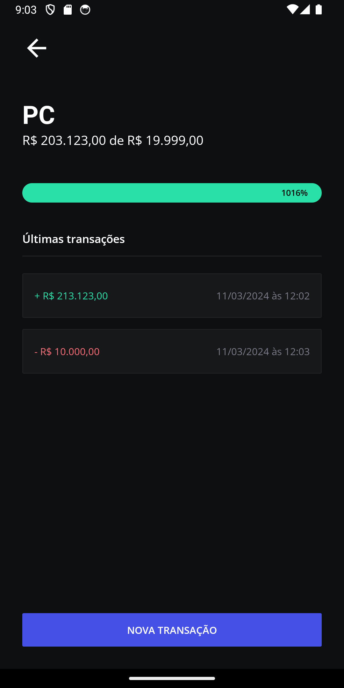

# My Goals App?



**My Goals App** is a practical app designed to help users save up for specific goals, such as purchasing a new notebook. Edson, for example, aims to buy a notebook priced at R$ 5,000. He finds it wise to save up the necessary funds to make the purchase outright, securing a good deal and avoiding the burden of monthly installments. With the My Goals App, he can set a savings goal and track his progress until he reaches the desired amount. This project was developed as part of a hands-on session during the React Native in Practice event (Rocketseat), leveraging Expo for streamlined cross-platform development.

## Technology

The following are the key technologies and tools used in the development of this app:

- **React Native**: It's a mobile app development framework that allows you to build native apps for iOS and Android using JavaScript and React. It enables mobile app development with a single codebase, providing a native user experience.
- **Expo**: It's an open-source platform and set of tools for building native mobile apps using JavaScript and React Native. Expo provides a range of ready-to-use components and APIs that streamline app development, including access to features like camera, geolocation, and push notifications.
- **Expo Router**: The Expo router is not a standalone library or module, but rather a part of the Expo SDK that facilitates navigation between screens in React Native apps built with Expo. It provides a simplified and declarative way to manage navigation within an app, allowing developers to define routes and navigate between them using components like StackNavigator, TabNavigator, and DrawerNavigator.
- **Expo SQLite**: It's a module of Expo that provides access to SQLite, a lightweight relational database, for local storage in Expo apps. SQLite is widely used in mobile apps for efficiently storing offline data.
- **Nativewind**: NativeWind uses Tailwind CSS as scripting language to create a universal style system for React Native. NativeWind components can be shared between platforms and will output their styles as CSS StyleSheet on web and StyleSheet.create for native.
- **React Native Gesture Handler**: It's a library that provides advanced touch gestures and interactions for React Native apps. It allows developers to implement gestures such as tap, swipe, and drag in an intuitive and responsive manner in their apps.
- **Dayjs**: It's a JavaScript library for date and time manipulation, designed to be lightweight and efficient. It offers a simple and expressive API for parsing, manipulating, and formatting dates, and it's a popular alternative to Moment.js due to its smaller size and better performance.

## How It Works

**My Goals App** is a practical app that allows users to set financial goals and track their savings efficiently. On the home screen, you'll find your current goals and the latest transactions, providing an overview of your financial progress. With a simple tap on the addition icon, you can easily add a new goal. Once added, it will be displayed in the list, and by selecting it, you can record new transactions, such as deposits or withdrawals, to track your progress towards the goal. With My Goals, you can manage your finances in an organized and effective manner, making it easier to achieve your financial objectives.

### Home

The home screen of the My Goals App displays a list of the user's current financial goals along with a summary of their recent transactions. Additionally, there's an add button allowing users to effortlessly include a new financial goal. This layout provides a quick and convenient overview of the user's financial goals and recent activities, enabling effective tracking of financial progress.

### New Transaction

The new transaction screen in the My Goals App offers a streamlined interface for users to seamlessly record their progress towards their financial objectives. It presents essential elements such as goal details, the amount input field for deposits, and a confirm button for quick transaction submission. Moreover, users can effortlessly review their recent transactions associated with the selected goal, enhancing their ability to track and manage their financial activities effectively.

## Screenshots

### Home



### New Transaction



## Installation

To run the app locally, follow these steps:

1. Clone the repository:

   ```bash
   git clone https://github.com/edsoncamargo/my-goals-app
   cd your-path/my-goals-app
   ```

2. Install the dependencies:

   ```bash
   npm install
   ```

3. Start the app:

   ```bash
   npx expo start
   ```

4. Scan the QR code using the Expo Go app on your mobile device or use an emulator to test the app.

## Contribution

You are welcome to contribute to the development of this project. If you find bugs, wish to add new features, or improve usability, feel free to open an issue or submit a pull request.

## Contact

- Name: Edson Camargo Menezes
- Email: contact@edsoncamargo.dev

## Acknowledgments

Special thanks to everyone who contributed to making this app a reality, especially Rocketseat for their invaluable support and guidance throughout the development process. Your expertise and dedication have been instrumental in bringing this project to fruition.

Enjoy using **My Goals App!**
